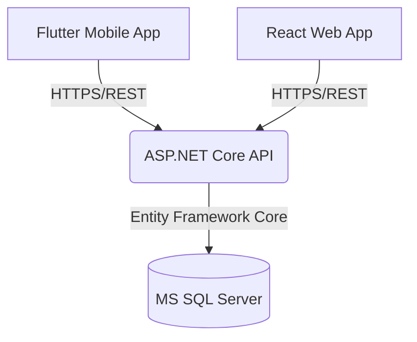

# CBE Meeting Attendance System

A comprehensive, multi-platform solution for tracking and managing meeting attendance for the Commercial Bank of Ethiopia (CBE).

## Overview

The CBE Meeting Attendance System digitizes and simplifies the process of employee registration and meeting attendance tracking. It eliminates manual paper-based processes by providing a robust backend API, a responsive web dashboard for administrators, and a mobile application for on-the-go access. 

## Features

- **Employee Management:** Register, update, and manage employee records.
- **Attendance Tracking:** Seamlessly take and verify attendance for meetings.
- **Role-Based Access Control:** Secure JWT-based authentication separating admins and standard users.
- **Location Awareness:** Mobile application supports geolocation for location-verified check-ins.
- **Data Export:** Generate and export attendance reports in PDF format.
- **Multi-Platform Access:** Accessible via Web Dashboard (Admins) and Mobile App (Employees/Users).

## Tech Stack

**Backend**
- C# & ASP.NET Core
- Entity Framework Core
- MS SQL Server
- JWT for Authentication
- QuestPDF for report generation

**Frontend**
- React 19 (Vite)
- Tailwind CSS v4
- React Router DOM
- Axios
- i18next (Localization)

**Mobile Application**
- Flutter
- Provider (State Management)
- Dio (Networking)
- Geolocator

**DevOps & Deployment**
- Docker & Docker Compose

## Architecture

The system follows a standard client-server architecture:
- **Database:** Microsoft SQL Server stores all employee, attendance, and user data.
- **API (Backend):** The ASP.NET Core API acts as the central hub, handling business logic, authentication, and database interactions.
- **Clients:** 
  - The React Web App communicates with the API to provide an administrative dashboard.
  - The Flutter Mobile App communicates with the API to facilitate mobile attendance taking and user interactions.



## Project Structure

```text
bank/
├── CbeMeetingAttendance/    # ASP.NET Core Backend API
│   ├── Controller/          # API Endpoints
│   ├── DTO/                 # Data Transfer Objects
│   ├── Model/               # Entity Models
│   ├── Service/             # Business Logic
│   └── ...
├── frontend/                # React Web Dashboard
│   ├── src/                 # UI Components and Pages
│   └── package.json
├── mobileapp/               # Flutter Mobile Application
│   ├── lib/                 # Dart Code (Screens, Services, Models)
│   └── pubspec.yaml
└── docker-compose.yml       # Docker orchestration configuration
```

## Prerequisites

Before setting up the project, ensure you have the following installed:
- [.NET SDK](https://dotnet.microsoft.com/download) (Version 8.0 or higher)
- [Node.js](https://nodejs.org/) & npm
- [Flutter SDK](https://docs.flutter.dev/get-started/install)
- [Docker & Docker Compose](https://www.docker.com/)

## Installation and Setup

1. **Clone the repository:**
   ```bash
   git clone <repository-url>
   cd bank
   ```

2. **Backend Setup:**
   Navigate to the backend directory and restore dependencies:
   ```bash
   cd CbeMeetingAttendance
   dotnet restore
   ```
   *Note: Database migrations are automatically applied on application startup (configured in `Program.cs`).*

3. **Frontend Setup:**
   Navigate to the frontend directory and install NPM packages:
   ```bash
   cd frontend
   npm install
   ```

4. **Mobile App Setup:**
   Navigate to the mobile app directory and get Flutter packages:
   ```bash
   cd mobileapp
   flutter pub get
   ```

## Running the Project

### Option 1: Using Docker (Recommended for quick start)

The project includes a `docker-compose.yml` file to spin up the database, backend API, and frontend simultaneously.

```bash
# In the root directory
docker-compose up -d --build
```
- API will run on port `8080`
- Frontend will run on port `80`
- SQL Server will run on port `1433`

### Option 2: Running Manually

**1. Database & Backend API:**
Start a local SQL Server instance or use Docker just for the database. Then run the API:
```bash
cd CbeMeetingAttendance
dotnet run --launch-profile http --urls "http://0.0.0.0:5157"
```

**2. Frontend Web App:**
```bash
cd frontend
npm run dev
```

**3. Mobile Application:**
Ensure you have an emulator running or a physical device connected:
```bash
cd mobileapp
flutter run
```

## API Documentation

When running in a development environment, the backend serves automated API documentation via Swagger. You can access the Swagger UI by navigating to:
`http://localhost:5157/swagger` (or `http://localhost:8080/swagger` if using Docker).
Here, you can explore endpoints, view payload schemas, and authorize using your JWT tokens to test secured routes.

## How It Works

1. **Authentication:** Users log in through the Web or Mobile interface. The API validates credentials and returns a JWT which is used for subsequent requests.
2. **Attendance Tracking:** The mobile app leverages the `geolocator` package to verify the employee's physical location before making a REST call via `Dio` to the API's attendance endpoints.
3. **Data Handling:** The ASP.NET Core backend processes the request using the `AttendanceService`, saves the record via Entity Framework Core, and returns the status.
4. **Reporting:** Admins can use the web frontend to view attendance records or export them as PDFs using the QuestPDF library integration on the backend.

## Future Improvements

- Add offline support and synchronization for the mobile app.
- Implement biometric authentication on the mobile application.
- Enhance the admin dashboard with graphical analytics and charting.
- Add email/SMS notifications for meeting reminders.

## Author

- **robelnigusse**
